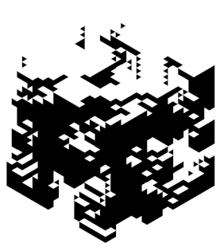

  
  <b>
 Redes de Computadores | Engenharia da Computação | Segurança da Informação
  <b rel="nofollow" href="https://github.com/l34-n/l34-n/blob/main/trian.gif">
    
  </b>

 
  
## 
  

  

    
    
    

    
    
## 
    
    

  
